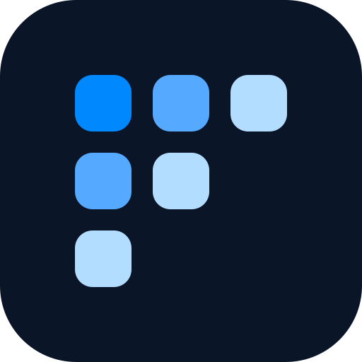

  

# Custom Relevance

A ranking playground. Type a list of things and a few plain-language factors, and Jev scores every pair live into a weighted ranking.

[jev.foglight.co](https://jev.foglight.co)

## World map

[jev.foglight.co/map](https://jev.foglight.co/map) colors every country from red to green by any factor you type, such as "quality of street food".

- One Jev request scores all 176 countries, with one 5-level rubric question per country (about 12k input tokens).
- Colors are relative to the results, so red is the lowest-scoring country and green the highest.
- The factor lives in the URL (`/map?factor=…`), so maps can be shared. Each browser caches its 20 most recent maps, so repeat factors don't call Jev again.
- Map scores share the daily dollar budget (`JEV_DAILY_BUDGET_USD`) and have their own per-IP limit (`JEV_IP_DAILY_MAP_CALLS`, default 30).

Scores come from Jev via [TypeSafe](https://typesafe.ai)’s System One API.
